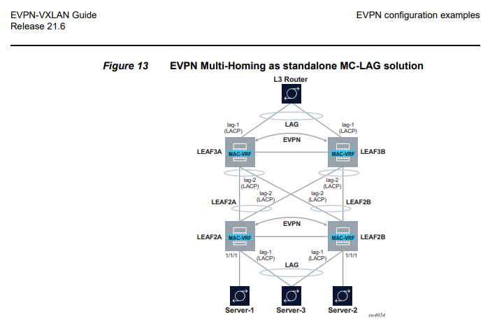
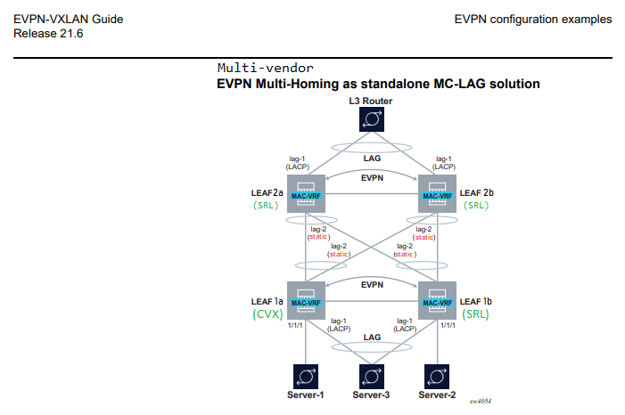

# VNI versus EVI

As defined in [RFC8365](https://datatracker.ietf.org/doc/html/rfc8365) and (also) illustrated by Juniper [here](https://www.juniper.net/documentation/us/en/software/junos/evpn-vxlan/topics/concept/vxlan-evpn-integration-overview.html) under "VNI Aware Service Use Case", a VxLAN Network Identifier (VNI) is not the same thing as an [EVPN Instance (EVI)](https://datatracker.ietf.org/doc/html/rfc7432#section-3).


## VxLAN Network Identifier (VNI)
A VxLAN Network Identifier (VNI) is a 24-bit label that is used as part of UDP encapsulation: A data plane identifier to distinguish between different services, for example traffic from different customers or different applications. It can be viewed as an extension of the 12-bit VLAN concept.

## EVPN Instance (EVI)
An EVPN Instance is* a 16-bit value used to identify unique EVPN services inside a given network.

(*) For most data center infrastructure / use cases

## Virtual Identifier to EVI mapping
12-bit VLANs and their 24-bit overlay cousins VNIs [can be mapped](https://datatracker.ietf.org/doc/html/rfc8365#section-5.1.2) to 16-bit EVIs in 2 distinct ways:
1. 1:1 Single broadcast domain (e.g. subnet) <-> unique EVI
2. n:1 Multiple broadcast domains -> single EVI

In the former case, it is possible to [auto-derive](https://datatracker.ietf.org/doc/html/rfc8365#section-5.1.2.1) EVPN RD and RT values as \<router-id\>:VNI and \<2-byte-AS\>:VNI respectively.

In SR Linux, the EVI and VNI for a service are provisioned separately (under the mac-vrf instance and the VxLAN tunnel-interface respectively). Cumulus only provisions the VNI and assumes the EVI is the same (implicitly limiting usable VXLAN ID space to 16 bits for auto-rd/rt). Since we cannot provision the EVI, interop requirements force us to configure VNI==EVI, keeping VNIs below 65536.

# Bonding with Link Aggregation Control Protocol (LACP)
All network operating systems support bonding (LAGs) with LACP, but they vary in the degree to which parameters can be configured.

## SR Linux
In SRL, a sample LACP configuration [looks like this](https://github.com/jbemmel/srl-self-organizing/blob/main/labs/evpn-mh-as-mc-lag/leaf1b_config.json#L1289):
```
lag {
        lag-type lacp
        member-speed 100G
        lacp {
            interval SLOW
            lacp-mode ACTIVE
            admin-key 15
            system-id-mac 44:38:39:be:ef:aa
            system-priority 65535
        }
   }

and optionally under /interface {
  ethernet {
    lacp-port-priority 32768
  }
}

```

On the wire, a partner device receives it like this:
```
14:40:38.899850 eth2  M   ifindex 2259 02:12:b4:ff:00:02 ethertype Slow Protocols (0x8809), length 130: LACPv1, length 110
	Actor Information TLV (0x01), length 20
	  System 44:38:39:be:ef:aa, System Priority 65535, Key 15, Port 1, Port Priority 32768
	  State Flags [Activity, Aggregation, Synchronization, Collecting, Distributing]
	Partner Information TLV (0x02), length 20
	  System aa:c1:ab:94:82:62, System Priority 65535, Key 15, Port 2, Port Priority 255
	  State Flags [Activity, Aggregation, Synchronization, Collecting, Distributing]
	Collector Information TLV (0x03), length 16
	  Max Delay 0
	Terminator TLV (0x00), length 0
```
Fairly straightforward, and fully configurable.

## Cumulus CVX
On Cumulus, a bond configuration with LACP enabled [looks like this](https://github.com/jbemmel/srl-self-organizing/blob/main/labs/evpn-mh-as-mc-lag/cumulus_leaf1a_interfaces#L28):
```
# Bond towards leaf2a/leaf2b
auto bond2
iface bond2
    mtu 9000
    es-sys-mac 44:38:39:BE:EF:AA
    bond-slaves sw50 sw51
    bond-mode 802.3ad
    bond-lacp-rate slow
    bond-lacp-bypass-allow yes
    bridge-access 4094
```
One can configure 'lacp bypass' (SRL calls this "LACP fallback mode") and the rate (fast meaning once per second, or slow every 30s), but not the 'admin-key', 'system-priority' or 'port-priority'. Based on tcpdump output, those priorities appear to be fixed (for all bonds) at 65535 and 255 respectively. It is unclear how the admin-key is determined (in this setup we get 15), but it is *the same across both bonds*. That results in a catch 22: SRL requires unique admin keys across lags (given that per IEEE 802.3ad standards, links with the same system ID and admin key can potentially aggregate) while CVX sets them identical. One cannot match LACP settings on multiple bonds in a multi-vendor MC-LAG setting that includes Cumulus switches (unless one manually configures /sys/class/net/bond1/bonding/ad_actor_key to be something else; the [3.0.1 guide](https://manualzz.com/doc/32498585/cumulus-linux-3.0.1-user-guide#p11) seems to suggest that it may be configured with a fixed system wide value)

Moreover, note how the LACP system MAC address is based on the 'es-sys-mac', and the generated ESI value contains this same MAC address (using a Type 0x3 ESI).
While logical, this further reduces flexibility with respect to possible configurations. SR Linux can match the Cumulus configuration by setting ESI==0x03:\<system-id-mac\>:... but vice versa is not always possible.

While SR Linux can match most Cumulus settings, it does not accept multiple lags with the same admin-key for LACP. As a workaround, we can use static lags on the network facing side instead; this results in the following Multi-Vendor EVPN Multi-Homing interop topology


# EVPN Control plane
At the control plane level, both systems send similar routes, with some vendor specific differences:

* Route Distinguisher: SRL uses a RD of \<system-ip\>:0 for Ethernet Segment routes, CVX uses multiple different ones:
```
A:leaf-1b-1.1.0.2# /show network-instance default protocols bgp neighbor 1.1.0.1 received-routes evpn                                                                                                              
-------------------------------------------------------------------------------------------------------------------------------------------------------------------------------------------------------------------
Peer        : 1.1.0.1, remote AS: 65000, local AS: 65000
Type        : static
Description : EVPN leaf-pair to support MC-LAG based on MH
Group       : evpn-peer-leaf
-------------------------------------------------------------------------------------------------------------------------------------------------------------------------------------------------------------------
Status codes: u=used, *=valid, >=best, x=stale
Origin codes: i=IGP, e=EGP, ?=incomplete
-------------------------------------------------------------------------------------------------------------------------------------------------------------------------------------------------------------------
-------------------------------------------------------------------------------------------------------------------------------------------------------------------------------------------------------------------
Type 1 Ethernet Auto-Discovery Routes
+--------+-----------------------------------+--------------------------------+------------+-----------------------------------+-----------------------------------+---------+-----------------------------------+
| Status |        Route-distinguisher        |              ESI               |   Tag-ID   |             Next-Hop              |                MED                | LocPref |               Path                |
+========+===================================+================================+============+===================================+===================================+=========+===================================+
| u*>    | 1.1.0.1:2                         | 03:aa:c1:ab:00:03:00:00:00:02  | 0          | 1.1.0.1                           | -                                 | 100     |                                   |
| u*>    | 1.1.0.1:2                         | 03:aa:c1:ab:00:03:00:00:00:03  | 0          | 1.1.0.1                           | -                                 | 100     |                                   |
| u*>    | 1.1.0.1:3                         | 03:aa:c1:ab:00:03:00:00:00:02  | 4294967295 | 1.1.0.1                           | -                                 | 100     |                                   |
| u*>    | 1.1.0.1:4                         | 03:aa:c1:ab:00:03:00:00:00:03  | 4294967295 | 1.1.0.1                           | -                                 | 100     |                                   |
+--------+-----------------------------------+--------------------------------+------------+-----------------------------------+-----------------------------------+---------+-----------------------------------+
Type 2 MAC-IP Advertisement Routes
+--------+------------------------------+------------+-------------------+------------------------------+------------------------------+------------------------------+---------+------------------------------+
| Status |     Route-distinguisher      |   Tag-ID   |    MAC-address    |          IP-address          |           Next-Hop           |             MED              | LocPref |             Path             |
+========+==============================+============+===================+==============================+==============================+==============================+=========+==============================+
| u*>    | 1.1.0.1:2                    | 0          | 00:11:22:33:44:01 | 0.0.0.0                      | 1.1.0.1                      | -                            | 100     |                              |
| u*>    | 1.1.0.1:2                    | 0          | 00:11:22:33:44:03 | 0.0.0.0                      | 1.1.0.1                      | -                            | 100     |                              |
| u*>    | 1.1.0.1:2                    | 0          | 00:60:08:69:97:EF | 0.0.0.0                      | 1.1.0.1                      | -                            | 100     |                              |
| u*>    | 1.1.0.1:2                    | 0          | 1A:B0:07:FF:01:01 | 0.0.0.0                      | 1.1.0.1                      | -                            | 100     |                              |
| u*>    | 1.1.0.1:2                    | 0          | AA:C1:AB:95:BF:BB | 0.0.0.0                      | 1.1.0.1                      | -                            | 100     |                              |
+--------+------------------------------+------------+-------------------+------------------------------+------------------------------+------------------------------+---------+------------------------------+
-------------------------------------------------------------------------------------------------------------------------------------------------------------------------------------------------------------------
Type 3 Inclusive Multicast Ethernet Tag Routes
+--------+--------------------------------------+------------+---------------------+--------------------------------------+--------------------------------------+---------+--------------------------------------+
| Status |         Route-distinguisher          |   Tag-ID   |    Originator-IP    |               Next-Hop               |                 MED                  | LocPref |                 Path                 |
+========+======================================+============+=====================+======================================+======================================+=========+======================================+
| u*>    | 1.1.0.1:2                            | 0          | 1.1.0.1             | 1.1.0.1                              | -                                    | 100     |                                      |
+--------+--------------------------------------+------------+---------------------+--------------------------------------+--------------------------------------+---------+--------------------------------------+
-------------------------------------------------------------------------------------------------------------------------------------------------------------------------------------------------------------------
Type 4 Ethernet Segment Routes
+--------+------------------------------+--------------------------------+------------------------------+------------------------------+------------------------------+---------+------------------------------+
| Status |     Route-distinguisher      |              ESI               |        Originator-IP         |           Next-Hop           |             MED              | LocPref |             Path             |
+========+==============================+================================+==============================+==============================+==============================+=========+==============================+
| u*>    | 1.1.0.1:3                    | 03:aa:c1:ab:00:03:00:00:00:02  | 1.1.0.1                      | 1.1.0.1                      | -                            | 100     |                              |
| u*>    | 1.1.0.1:4                    | 03:aa:c1:ab:00:03:00:00:00:03  | 1.1.0.1                      | 1.1.0.1                      | -                            | 100     |                              |
+--------+------------------------------+--------------------------------+------------------------------+------------------------------+------------------------------+---------+------------------------------+
-------------------------------------------------------------------------------------------------------------------------------------------------------------------------------------------------------------------
```
We see 2 kinds of Type-1 Ethernet Segment routes:
1. EAD per EVI (tag 0, RD:2), used for aliasing and load balancing of traffic to multiple switches
2. EAD per ES (tag 0xffffffff), used for faster convergence during access failure scenarios.

In contrast, SRL sends this:
```
A:leaf-1b-1.1.0.2# /show network-instance default protocols bgp neighbor 1.1.0.1 advertised-routes evpn                                                                                                            
-------------------------------------------------------------------------------------------------------------------------------------------------------------------------------------------------------------------
Peer        : 1.1.0.1, remote AS: 65000, local AS: 65000
Type        : static
Description : EVPN leaf-pair to support MC-LAG based on MH
Group       : evpn-peer-leaf
-------------------------------------------------------------------------------------------------------------------------------------------------------------------------------------------------------------------
Origin codes: i=IGP, e=EGP, ?=incomplete
-------------------------------------------------------------------------------------------------------------------------------------------------------------------------------------------------------------------
-------------------------------------------------------------------------------------------------------------------------------------------------------------------------------------------------------------------
Type 1 Ethernet Auto-Discovery Routes
+-------------------------------------+--------------------------------+------------+-------------------------------------+-------------------------------------+---------+-------------------------------------+
|         Route-distinguisher         |              ESI               |   Tag-ID   |              Next-Hop               |                 MED                 | LocPref |                Path                 |
+=====================================+================================+============+=====================================+=====================================+=========+=====================================+
| 1.1.0.2:4094                        | 03:aa:c1:ab:00:03:00:00:00:02  | 0          | 1.1.0.2                             | -                                   | 100     |                                     |
| 1.1.0.2:4094                        | 03:aa:c1:ab:00:03:00:00:00:02  | 4294967295 | 1.1.0.2                             | -                                   | 100     |                                     |
| 1.1.0.2:4094                        | 03:aa:c1:ab:00:03:00:00:00:03  | 0          | 1.1.0.2                             | -                                   | 100     |                                     |
| 1.1.0.2:4094                        | 03:aa:c1:ab:00:03:00:00:00:03  | 4294967295 | 1.1.0.2                             | -                                   | 100     |                                     |
+-------------------------------------+--------------------------------+------------+-------------------------------------+-------------------------------------+---------+-------------------------------------+
Type 3 Inclusive Multicast Ethernet Tag Routes
+----------------------------------------+------------+---------------------+----------------------------------------+----------------------------------------+---------+----------------------------------------+
|          Route-distinguisher           |   Tag-ID   |    Originator-IP    |                Next-Hop                |                  MED                   | LocPref |                  Path                  |
+========================================+============+=====================+========================================+========================================+=========+========================================+
| 1.1.0.2:4094                           | 0          | 1.1.0.2             | 1.1.0.2                                | -                                      | 100     |                                        |
+----------------------------------------+------------+---------------------+----------------------------------------+----------------------------------------+---------+----------------------------------------+
-------------------------------------------------------------------------------------------------------------------------------------------------------------------------------------------------------------------
Type 4 Ethernet Segment Routes
+--------------------------------+--------------------------------+--------------------------------+--------------------------------+--------------------------------+---------+--------------------------------+
|      Route-distinguisher       |              ESI               |         Originating-IP         |            Next-Hop            |              MED               | LocPref |              Path              |
+================================+================================+================================+================================+================================+=========+================================+
| 1.1.0.2:0                      | 03:aa:c1:ab:00:03:00:00:00:02  | 1.1.0.2                        | 1.1.0.2                        | -                              | 100     |                                |
| 1.1.0.2:0                      | 03:aa:c1:ab:00:03:00:00:00:03  | 1.1.0.2                        | 1.1.0.2                        | -                              | 100     |                                |
+--------------------------------+--------------------------------+--------------------------------+--------------------------------+--------------------------------+---------+--------------------------------+
```
SRL uses the same RD for most routes, auto-derived from the EVI (== VNI here) based on [RFC7432](https://datatracker.ietf.org/doc/html/rfc7432#section-7.9).
For Type 4 routes it uses \<router-id\>:0 as RD. These implementation choices make tracing routes across the EVPN control plane a lot easier, a critical difference especially at larger scale. 65535 different RD values may seem like a lot, but it is better to be frugal where possible.

The BGP routes view may help understand what's going on here:
```
A:leaf-1b-1.1.0.2# /show network-instance default protocols bgp routes evpn route-type summary                                                                                                                     
-------------------------------------------------------------------------------------------------------------------------------------------------------------------------------------------------------------------
Show report for the BGP route table of network-instance "default"
-------------------------------------------------------------------------------------------------------------------------------------------------------------------------------------------------------------------
Status codes: u=used, *=valid, >=best, x=stale
Origin codes: i=IGP, e=EGP, ?=incomplete
-------------------------------------------------------------------------------------------------------------------------------------------------------------------------------------------------------------------
BGP Router ID: 1.1.0.2      AS: 65000      Local AS: 65000
-------------------------------------------------------------------------------------------------------------------------------------------------------------------------------------------------------------------
-------------------------------------------------------------------------------------------------------------------------------------------------------------------------------------------------------------------
Type 1 Ethernet Auto-Discovery Routes
+--------+-----------------+--------------------------------+------------+------------+-------------+----------+
| Status |     Route-      |              ESI               |   Tag-ID   |  neighbor  |  Next-hop   |   VNI    |
|        |  distinguisher  |                                |            |            |             |          |
+========+=================+================================+============+============+=============+==========+
| u*>    | 1.1.0.1:2       | 03:aa:c1:ab:00:03:00:00:00:02  | 0          | 1.1.0.1    | 1.1.0.1     | 4094     |
| u*>    | 1.1.0.1:2       | 03:aa:c1:ab:00:03:00:00:00:03  | 0          | 1.1.0.1    | 1.1.0.1     | 4094     |
| u*>    | 1.1.0.1:3       | 03:aa:c1:ab:00:03:00:00:00:02  | 4294967295 | 1.1.0.1    | 1.1.0.1     | -        |
| u*>    | 1.1.0.1:4       | 03:aa:c1:ab:00:03:00:00:00:03  | 4294967295 | 1.1.0.1    | 1.1.0.1     | -        |
+--------+-----------------+--------------------------------+------------+------------+-------------+----------+
Type 2 MAC-IP Advertisement Routes
+--------+-----------------+------------+-------------------+-----------------------------------------+------------+------------------------+----------+--------------------------------+------------------------+
| Status |     Route-      |   Tag-ID   |    MAC-address    |               IP-address                |  neighbor  |        Next-Hop        |   VNI    |              ESI               |      MAC Mobility      |
|        |  distinguisher  |            |                   |                                         |            |                        |          |                                |                        |
+========+=================+============+===================+=========================================+============+========================+==========+================================+========================+
| u*>    | 1.1.0.1:2       | 0          | 00:11:22:33:44:01 | 0.0.0.0                                 | 1.1.0.1    | 1.1.0.1                | 4094     | 00:00:00:00:00:00:00:00:00:00  | -                      |
| u*>    | 1.1.0.1:2       | 0          | 00:11:22:33:44:03 | 0.0.0.0                                 | 1.1.0.1    | 1.1.0.1                | 4094     | 03:aa:c1:ab:00:03:00:00:00:02  | -                      |
| u*>    | 1.1.0.1:2       | 0          | 00:60:08:69:97:EF | 0.0.0.0                                 | 1.1.0.1    | 1.1.0.1                | 4094     | 03:aa:c1:ab:00:03:00:00:00:02  | -                      |
| u*>    | 1.1.0.1:2       | 0          | 1A:B0:07:FF:01:01 | 0.0.0.0                                 | 1.1.0.1    | 1.1.0.1                | 4094     | 03:aa:c1:ab:00:03:00:00:00:03  | -                      |
| u*>    | 1.1.0.1:2       | 0          | AA:C1:AB:95:BF:BB | 0.0.0.0                                 | 1.1.0.1    | 1.1.0.1                | 4094     | 00:00:00:00:00:00:00:00:00:00  | -                      |
+--------+-----------------+------------+-------------------+-----------------------------------------+------------+------------------------+----------+--------------------------------+------------------------+
-------------------------------------------------------------------------------------------------------------------------------------------------------------------------------------------------------------------
Type 3 Inclusive Multicast Ethernet Tag Routes
+--------+-----------------+------------+---------------------+------------+--------------------------------------------------------------------------------------------------------------------------------------+
| Status |     Route-      |   Tag-ID   |    Originator-IP    |  neighbor  |                                                               Next-Hop                                                               |
|        |  distinguisher  |            |                     |            |                                                                                                                                      |
+========+=================+============+=====================+============+======================================================================================================================================+
| u*>    | 1.1.0.1:2       | 0          | 1.1.0.1             | 1.1.0.1    | 1.1.0.1                                                                                                                              |
+--------+-----------------+------------+---------------------+------------+--------------------------------------------------------------------------------------------------------------------------------------+
-------------------------------------------------------------------------------------------------------------------------------------------------------------------------------------------------------------------
Type 4 Ethernet Segment Routes
+--------+-----------------+--------------------------------+-------------------------------------------------------------------+------------+-------------------------------------------------------------------+
| Status |     Route-      |              ESI               |                        originating-router                         |  neighbor  |                             Next-Hop                              |
|        |  distinguisher  |                                |                                                                   |            |                                                                   |
+========+=================+================================+===================================================================+============+===================================================================+
| u*>    | 1.1.0.1:3       | 03:aa:c1:ab:00:03:00:00:00:02  | 1.1.0.1                                                           | 1.1.0.1    | 1.1.0.1                                                           |
| u*>    | 1.1.0.1:4       | 03:aa:c1:ab:00:03:00:00:00:03  | 1.1.0.1                                                           | 1.1.0.1    | 1.1.0.1                                                           |
+--------+-----------------+--------------------------------+-------------------------------------------------------------------+------------+-------------------------------------------------------------------+
```

* Extended communities: CVX includes an bgp-tunnel-encap:VXLAN extended community with its Ethernet Segment routes, SRL does not


## CVX
According to [the 4.4 manual](https://docs.nvidia.com/networking-ethernet-software/cumulus-linux-44/Network-Virtualization/Ethernet-Virtual-Private-Network-EVPN/EVPN-Multihoming/) EVPN MultiHoming requires the use of VLAN-aware bridging and ARP suppression. Specifically, [traditional bridges are not supported](https://docs.nvidia.com/networking-ethernet-software/cumulus-linux-44/Network-Virtualization/Ethernet-Virtual-Private-Network-EVPN/EVPN-Multihoming/#unsupported-features) in combination with EVPN MH.

Also, 
```
In a centralized routing deployment, you must configure layer 3 interfaces even if you configure the switch only for layer 2 (you are not using VXLAN routing). 
To avoid installing unnecessary layer 3 information, you can turn off IP forwarding.
```

After trying various options (including [NVUE](https://github.com/jbemmel/srl-self-organizing/blob/main/labs/evpn-mh-as-mc-lag/cumulus_leaf1a_nvue_startup.yaml), I ended up with the following configuration:
* [/etc/network/interfaces](https://github.com/jbemmel/srl-self-organizing/blob/main/labs/evpn-mh-as-mc-lag/cumulus_leaf1a_interfaces)
* [/etc/frr/frr.conf](https://github.com/jbemmel/srl-self-organizing/blob/main/labs/evpn-mh-as-mc-lag/cumulus_leaf1a_frr.conf)

For some reason things do not come up automatically upon boot, but after a ```ifreload -a``` we get:
```
root@leaf1a:mgmt:~# net show bridge vlan 

Interface  VLAN  Flags                  VNI
---------  ----  ---------------------  ----
swp1       4094  PVID, Egress Untagged
bond1      4094  PVID, Egress Untagged
bond2      4094
bridge        1  PVID, Egress Untagged
           4094
vni4094    4094  PVID, Egress Untagged  4094
```

# Verification

## Leaf1a (CVX)
```
root@leaf1a:mgmt:~# net show bgp l2vpn evpn es-evi
Flags: L local, R remote, I inconsistent
VTEP-Flags: E EAD-per-ES, V EAD-per-EVI
VNI      ESI                            Flags VTEPs
10       03:44:38:39:be:ef:aa:00:00:01  LR    1.1.0.2(EV)
10       03:44:38:39:be:ef:aa:00:00:02  LR    1.1.0.2(EV) 
```

## Leaf1b (SRL):
```
A:leaf-1b-1.1.0.2# /show system network-instance ethernet-segments                                                                                                                                                 
-------------------------------------------------------------------------------------------------------------------------------------------------------------------------------------------------------------------
ES-leaf1-leaf2.CE1 is up, all-active
  ESI      : 03:44:38:39:be:ef:aa:00:00:01
  Alg      : default
  Peers    : 1.1.0.1
  Interface: lag1
  Network-instances:
     Blue-MAC-VRF-10
      Candidates : 1.1.0.1 (DF), 1.1.0.2
      Interface : lag1.0
-------------------------------------------------------------------------------------------------------------------------------------------------------------------------------------------------------------------
ES-leaf1-leaf2.Spines is up, all-active
  ESI      : 03:44:38:39:be:ef:aa:00:00:02
  Alg      : default
  Peers    : 1.1.0.1
  Interface: lag2
  Network-instances:
     Blue-MAC-VRF-10
      Candidates : 1.1.0.1 (DF), 1.1.0.2
      Interface : lag2.0
-------------------------------------------------------------------------------------------------------------------------------------------------------------------------------------------------------------------
Summary
 2 Ethernet Segments Up
 0 Ethernet Segments Down
```
