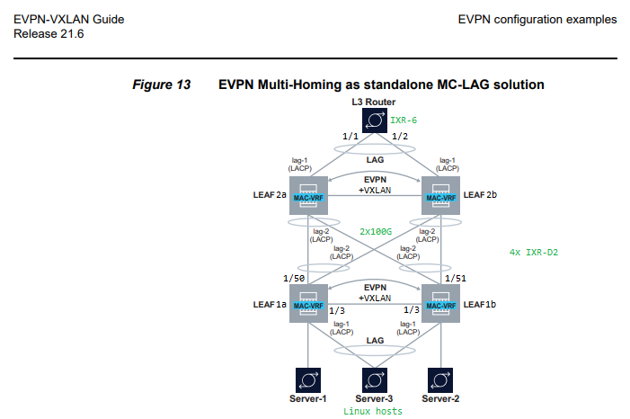

# EVPN Multi-Homing as a standards-based standalone MC-LAG solution

The [SR Linux Advanced Solutions Guide](https://infocenter.nokia.com/public/SRLINUX216R1A/index.jsp?topic=%2Fcom.srlinux.advsolutions%2Fhtml%2Fevpn-l2-multihome.html&cp=1_3) has an extensive section on EVPN Multi-Homing. Sample configurations are provided in great detail; this repo provides a working sample use case to explore one of those options.
