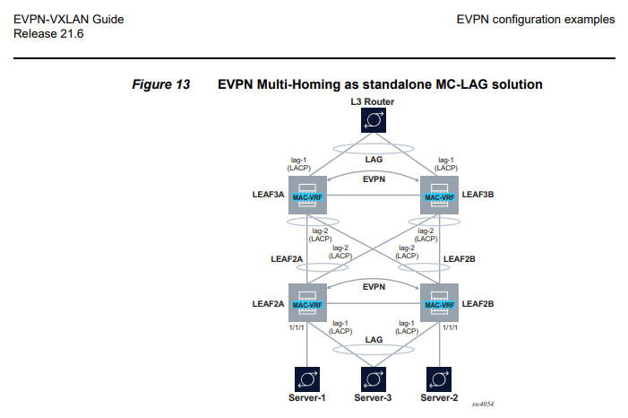

# VNI versus EVI

As (also) explained by Juniper [here](https://www.juniper.net/documentation/us/en/software/junos/evpn-vxlan/topics/concept/vxlan-evpn-integration-overview.html) under "VNI Aware Service Use Case", a Virtual Network Identifier (VNI) is not the same thing as an [EVPN Identifier (EVI)](https://datatracker.ietf.org/doc/html/rfc7432#section-3).
