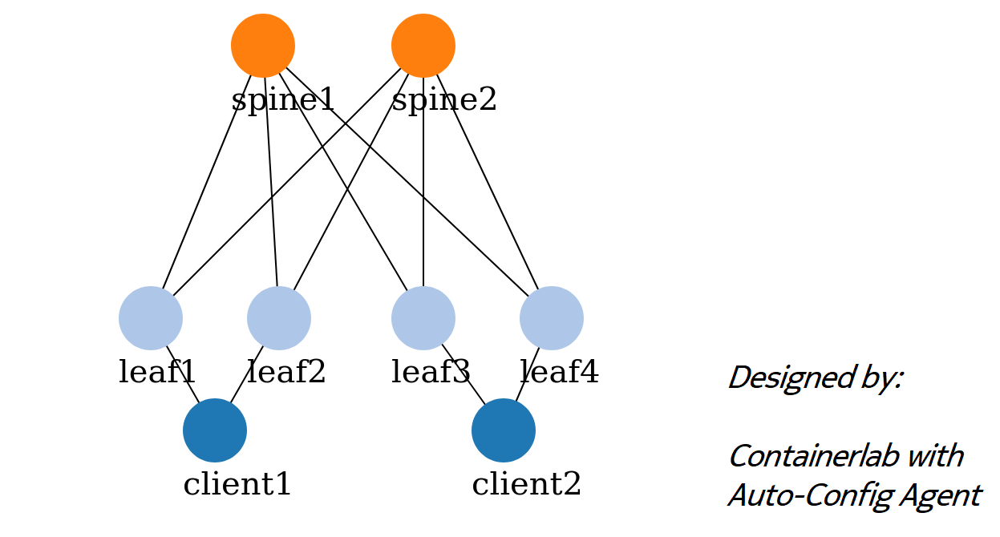

# Run this lab
```
sudo clab deploy -t spine-leaf-evpn.clab.yml --reconfigure
```

# Ping test (each client is in its own L3 subnet/vrf)
```
docker exec -it clab-spine-leaf-evpn-client1 ping -c3 10.0.3.103
```
